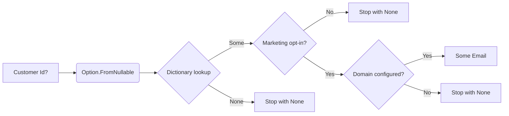

# Option Concept Guide

FunctionalExtensions models optional data with `Option<T>`, a lightweight discriminated union representing either “some value” or “no value.” Use it whenever the absence of data is expected and should be handled explicitly instead of throwing exceptions or relying on `null`.

## When to Reach for Option
- Use in repositories and caches where a lookup may legitimately miss.
- Wrap user input and parsing routines to avoid `null` plumbing.
- Compose optional calculations without branching; `Bind`, `Map`, and LINQ-style query expressions short-circuit automatically when a step returns `None`.

## Constructing Options
Create options via `Option<T>.Some`, `Option<T>.None`, or the helper factories in `Option` (`Option.FromNullable`, etc.). Normalize raw input into a safe option before composing further:

```csharp
public static Option<string> NormalizeInput(string? raw)
{
    var text = raw?.Trim();
    return string.IsNullOrWhiteSpace(text)
        ? Option<string>.None
        : Option<string>.Some(text);
}
```
_Snippet: `docs/snippets/Concepts/OptionConcepts.cs#region option_construct`_

## Transformations & Filtering
Every `Option<T>` exposes functional helpers (via C# 14 extension members) for mapping, binding, filtering, and pattern matching:

| Operation | Description |
| --- | --- |
| `Map` / `Select` | Transform the contained value while preserving option semantics. |
| `Bind` / `SelectMany` | Flatten nested options and enable LINQ query expressions. |
| `Where` | Filter the option by predicate, producing `None` when the predicate fails. |
| `Match` | Pattern match into explicit `Some`/`None` handlers. |
| `ToResult`, `ToTaskResult`, `ToTry`, `ToIO` | Bridge into other functional containers when you need richer error info or async behavior. |

### Example: Composing a Business Rule
The following pipeline builds a marketing email address only when the customer exists, has opted in, and a preferred domain is configured. Each failure automatically short-circuits the remainder of the workflow.

```csharp
public static Option<Email> BuildMarketingEmail(
    IDictionary<Guid, Customer> customers,
    IDictionary<string, string> domains,
    Guid? customerId)
{
    return Option.FromNullable(customerId)
        .Bind(id => customers.TryGetValue(id, out var customer)
            ? Option<Customer>.Some(customer)
            : Option<Customer>.None)
        .Where(customer => customer.MarketingOptIn)
        .Bind(customer => domains.TryGetValue(customer.PreferredDomain, out var domain)
            ? Option<Email>.Some(new Email($"{Slugify(customer.Name)}@{domain}"))
            : Option<Email>.None);
}
```
_Snippet: `docs/snippets/Concepts/OptionConcepts.cs#region option_pipeline`_



## Presenting Optional Results
`Match` keeps presentation logic explicit while preserving pipeline semantics:

```csharp
public static string DescribeEmail(Option<Email> email)
    => email.Match(
        whenSome: address => $"Ready to send to {address.Address}",
        whenNone: () => "Subscriber missing required data.");
```
_Snippet: `docs/snippets/Concepts/OptionConcepts.cs#region option_match`_

## Escalating to Result or TaskResult
When a missing value should surface an actionable error, convert the option into a `Result<T>` (or `TaskResult<T>` for async flows). Provide domain-specific error messages so upstream callers can react accordingly.

```csharp
public static Result<Email> RequireEmail(Option<Email> email)
    => email.ToResult("Email could not be constructed.");
```
_Snippet: `docs/snippets/Concepts/OptionConcepts.cs#region option_to_result`_

## Best Practices
- Normalize data once: push boundary checks (null/whitespace parsing) into small factory functions that return `Option<T>`.
- Favor `Where` over manual `if` statements when filtering; it keeps the pipeline expression-based.
- Convert to `Result` when the consumer needs to distinguish between “not found” vs “failed,” and embed context in the error string.
- Reuse options in LINQ query expressions for readability:
  ```csharp
  var newsletter = from customer in customersRepo.Find(id)
                   where customer.MarketingOptIn
                   from domain in domainsRepo.Find(customer.PreferredDomain)
                   select $"{customer.Name}@{domain}";
  ```
- Keep side effects inside `Tap` or at the end of the pipeline so they run only when a value exists.
