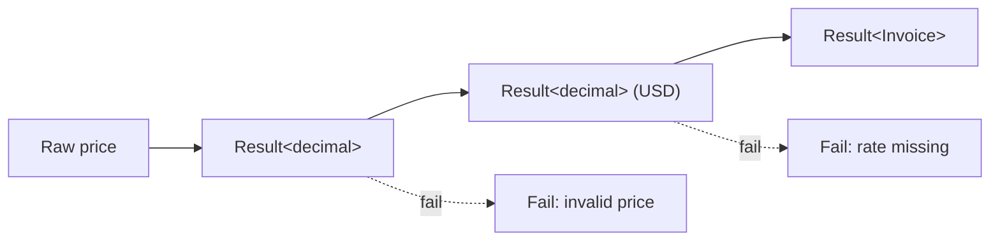

# Result Concept Guide

`Result<T>` represents either a successful value (`Ok`) or a failure carrying an error message. Use it to make exceptional flows explicit without throwing, especially when composing multi-step operations that can fail for business reasons.

## Creating Results
- `Result<T>.Ok(value)` when you already have a successful outcome.
- `Result<T>.Fail(error)` to encode domain-specific failures.
- `Result.Try` to wrap imperative logic (parsing, IO, external APIs) and convert exceptions into structured failures.

```csharp
public static Result<decimal> ParsePrice(string raw)
    => Result.Try(() =>
    {
        if (!decimal.TryParse(raw, out var value))
        {
            throw new FormatException($"Could not parse '{raw}'.");
        }

        return value;
    });
```
_Snippet: `docs/snippets/Concepts/ResultConcepts.cs#region result_try`_

## Composing Success Paths
`Bind` and `Map` (plus LINQ query expressions) let you build pipelines where each step can fail. Failures short-circuit and bubble the first error to the caller.

```csharp
public static Result<Invoice> BuildInvoice(string rawPrice, SalesOrder order, IExchangeRates rates)
{
    return ParsePrice(rawPrice)
        .Bind(amount => ConvertToCurrency(amount, order.Currency, "USD", rates))
        .Map(usd => new Invoice(order.Id, usd, "USD"));
}
```
_Snippet: `docs/snippets/Concepts/ResultConcepts.cs#region result_bind`_



## Recovery & Alternatives
Use `Recover`/`RecoverWith`/`OrElse` to swap in fallback values or alternative computations without losing the monadic style.

```csharp
public static Result<Invoice> FallbackInvoice(Result<Invoice> invoice, Invoice placeholder)
    => invoice.Recover(_ => placeholder);
```
_Snippet: `docs/snippets/Concepts/ResultConcepts.cs#region result_recover`_

The `|` operator also acts as an “or else,” returning the first successful result.

## Presenting Outcomes
`Match` keeps presentation logic clean and centralizes how you communicate success vs error states to the caller or UI layer.

```csharp
public static string Summarize(Result<Invoice> invoice)
    => invoice.Match(
        onOk: doc => $"Invoice {doc.Id} ready for {doc.Currency} {doc.Amount:F2}",
        onError: error => $"Invoice failed: {error}");
```
_Snippet: `docs/snippets/Concepts/ResultConcepts.cs#region result_match`_

## Interop
- `ToOption()` removes error details when you only need to know if a value exists.
- `ToTaskResult()` wraps the result into an async-friendly container.
- `ToIO()`/`ToTry()` convert the result into other effect systems in the library (IO, Try).
- `Option.ToResult`, `Validation.ToResult`, and `TaskResult.ToResultAsync` let you move in the other direction when escalating failures.

## Best Practices
- Provide actionable error messages (include identifiers, constraints) to help callers decide whether to retry, prompt the user, or log.
- Prefer `Result` for imperative workflows or anywhere exceptions would otherwise leak through the API surface.
- Combine with `TaskResult<T>` for asynchronous code so you never lose the structured error.
- Use `Tap` for logging/metrics side effects when the result succeeds, and `Recover` or `Match` for failure instrumentation.
