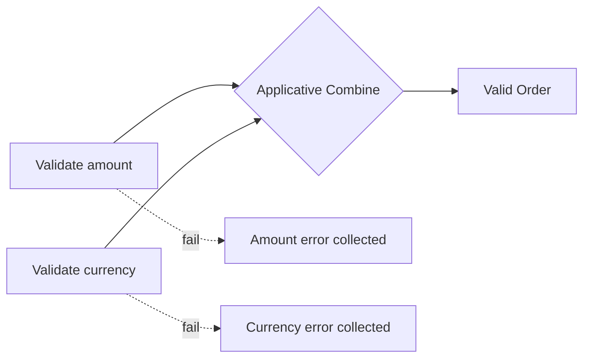

# Validation Concept Guide

`Validation<T>` accumulates multiple errors instead of stopping at the first failure. It is ideal for data entry, file imports, or API payloads where you want to report every issue in one pass. While `Result<T>` models sequential success/failure, `Validation<T>` favors parallel checks and applicative composition. The accompanying `Validator<T>` DSL (in `FunctionalExtensions.ValidationDsl`) provides a fluent way to declare reusable rule sets.

## Declarative Rule Sets with `Validator<T>`
`Validator<T>` stores an immutable list of rules evaluated against a subject. Each rule returns a `Validation<Unit>` so errors can accumulate.

```csharp
public static Validator<OrderDraft> DraftValidator { get; } = Validator<OrderDraft>.Empty
    .Ensure(d => !string.IsNullOrWhiteSpace(d.CustomerId), "CustomerId is required.")
    .Ensure(d => d.Total > 0, "Total must be positive.")
    .Ensure(d => d.Total <= 50_000, "Draft exceeds credit policy.")
    .Ensure(d => d.Currency?.Length == 3, "Currency must follow ISO-4217 (3 letters).");
```
_Snippet: `docs/snippets/Concepts/ValidationConcepts.cs#region validation_validator`_

Apply a validator to any draft object to receive a `Validation<T>` back:

```csharp
public static Validation<OrderDraft> ValidateDraft(OrderDraft draft)
    => DraftValidator.Apply(draft);
```
_Snippet: `docs/snippets/Concepts/ValidationConcepts.cs#region validation_apply`_

If none of the rules fail, the `Validation<T>` returns `IsValid=true` with the original draft; otherwise, every error message is aggregated into the `Errors` list.

## Applicative Composition
Combine independent `Validation<T>` values to build richer domain objects while preserving the full error set. Unlike `Result<T>`, both branches run even if one fails.

```csharp
public static Validation<ValidatedOrder> BuildOrder(OrderDraft draft)
{
    var amount = ValidateAmount(draft.Total);
    var currency = ValidateCurrency(draft.Currency);

    var constructor = amount
        .Map(validAmount => (Func<string, ValidatedOrder>)(validCurrency =>
            new ValidatedOrder(draft.CustomerId, validAmount, validCurrency)));

    return currency.Apply(constructor);
}
```
_Snippet: `docs/snippets/Concepts/ValidationConcepts.cs#region validation_applicative`_



## Escalating to Result/TaskResult
Once you’re ready to halt the workflow on failure, bridge the validation outcome to a `Result<T>` (or `TaskResult<T>`) with context-specific messaging.

```csharp
public static Result<ValidatedOrder> RequireOrder(OrderDraft draft)
    => BuildOrder(draft).ToResult("Draft failed validation.");
```
_Snippet: `docs/snippets/Concepts/ValidationConcepts.cs#region validation_to_result`_

## Best Practices
- Group rules by concern (identity, totals, policy) and compose validators via `Append` when scenarios overlap.
- For nested objects, use lenses (`Ensure(lens, predicate, error)`) so you can focus validation on specific sub-properties without duplicating boilerplate.
- Prefer `Validation<T>` for user-facing forms, CLI parsing, and import jobs; swap to `Result<T>` for imperative workflows where the first error should short-circuit.
- Keep error messages concrete (“Currency must be ISO-4217”) to help front-end clients build actionable responses.
- Back validation rules with automated snippet tests (`dotnet build docs/snippets/FunctionalExtensions.Snippets.csproj`) so examples in the docs never drift from the shipped API.
